*This project was created as part of the 42 curriculum by [lyaberge] and [mvignes].*

# cub3D

## Description

`cub3D` is a 42 school project, the goal of the project is to create a pseudo-3D game rendering from a 2D map using the **raycasting** technique.
The player can move inside a map, rotate the camera, interact with the environment, and see the world rendered from a first-person perspective.

<p align="center">
	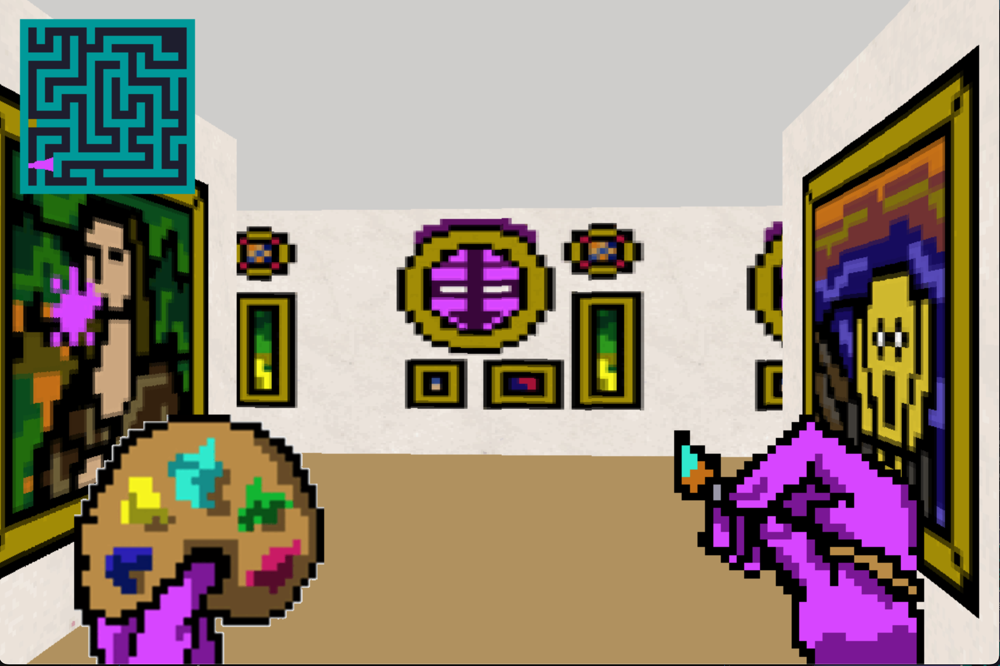
</p>
---

## Parsing

The parsing part is responsible for reading and validating the `.cub` configuration file.

The file contains several types of information:

### Textures

Each wall direction must have a valid texture path:

* `NO` for the north wall texture
* `SO` for the south wall texture
* `WE` for the west wall texture
* `EA` for the east wall texture

The parser checks that every required texture exists and can be loaded correctly.

### Colors

The floor and ceiling colors are parsed from the file:

* `F` for the floor color
* `C` for the ceiling color

Each color must be written in RGB format:

```txt
F 220,100,0
C 225,30,0
```

The parser checks that the RGB values are valid and between `0` and `255`.

### Map

The map is parsed as a 2D grid.

Accepted characters are:

* `N`, `S`, `E`, `W` for the player's initial position and orientation
* `1` for walls
* `0` for empty floor
* `P` for doors
* `M` for enemies
* spaces for empty areas outside the playable map

The parser checks that:

* the map contains exactly one player
* the map is surrounded by walls or valid empty spaces
* every playable tile is correctly enclosed
* invalid characters are rejected
* the player cannot spawn outside the valid map area

For every playable character except walls, we check the surrounding tiles.
If a playable tile is next to an invalid character, a space, or an empty line in a way that opens the map, the map is considered invalid and an error is returned.

Map example:

```
111111111111111
111111000111111
111110000011111
1111000N0001111
111000000000111
110000000000011
100001111100001
110000111000011
111000010000111
111100000001111
111110000011111
111111000111111
111111111111111
```

---

## Minimap

We developed a minimap to visualize the map in 2D while playing.

The minimap displays:

* walls
* floor tiles
* the player position
* the player direction
* doors
* enemies

The full minimap is displayed when the window is large enough.
If the map is too large for the screen, or if the player wants a smaller display, the tiny minimap is used instead.

Minimap Preview:

<p align="center">
	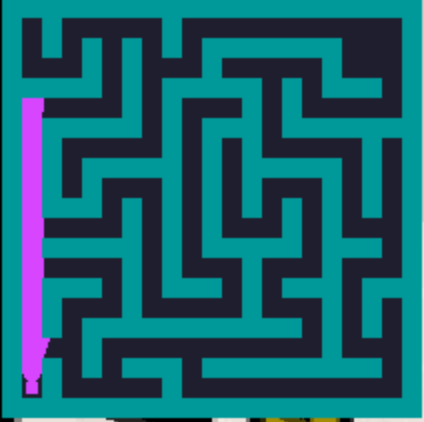
	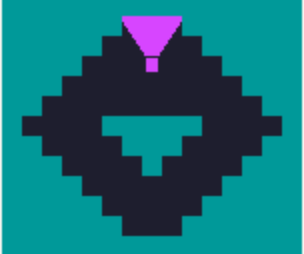
	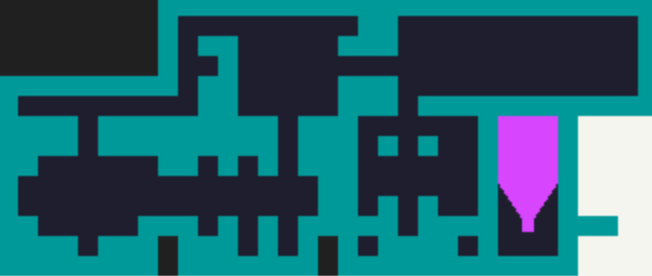
</p>

---

## Tiny Minimap

The tiny minimap is a smaller minimap centered around the player.

It is used when:

* the map is too large to be fully displayed
* the window is too small
* the player presses the `M` key to switch minimap mode

The idea is that the player always stays visually centered in the tiny minimap, while the surrounding map moves around them.

Only a limited number of tiles around the player are displayed.
This number is defined by the `CASE_FROM_PLAYER` value.

The conversion from map coordinates to screen pixels is done with logic similar to:

```c
pixel_x = player_center_x + (map_x - player.pos_x) * SIZE_SQUARE;
pixel_y = player_center_y + (map_y - player.pos_y) * SIZE_SQUARE;
```

This keeps the player centered while moving the map around them smoothly.

Preview:
<p align="center">
	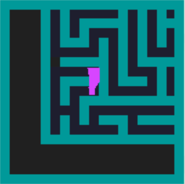
	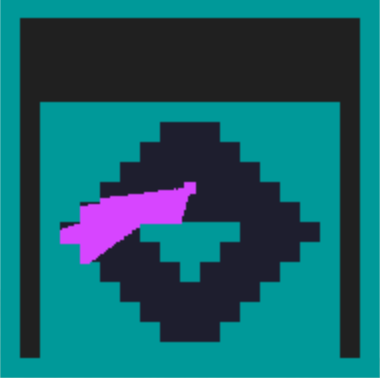
	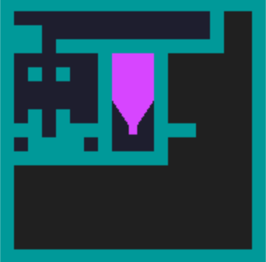
</p>

---

## Player Movement

The player can move using the keyboard:

* `W`         -> to move forward
* `S`         -> to move backward
* `A`         -> to move left
* `D`         -> to move right
* left arrow  -> to rotate left
* right arrow -> to rotate right
* `M`         -> to switch minimap mode
* `ESC`       -> to quit the game
* `O`         -> to open the doors

The player has a position:

```c
pos_x
pos_y
```

And a direction vector:

```c
dir_x
dir_y
```

To move forward, the direction vector is added to the player position.
To move backward, it is subtracted from the player position.
To move left or right, a perpendicular direction vector is used.

Using `double` values for the player position allows smoother movement than moving tile by tile.

---

## Camera Rotation

The camera direction depends on the player's starting orientation in the map:

* `N` for north
* `S` for south
* `E` for east
* `W` for west

At the beginning of the game, the player receives an initial angle depending on this orientation.

When the player presses the left or right arrow, the angle is updated and the direction vector is recalculated with:

```c
dir_x = cos(angle);
dir_y = sin(angle);
```

The camera plane is also updated:

```c
plane_x = -dir_y * 0.66;
plane_y = dir_x * 0.66;
```

The direction vector represents where the player is looking, while the camera plane is used for the raycasting field of view.

---

## Collisions

We added a collision system to prevent the player from walking through walls.

Before updating the player position, the program first calculates the next position the player wants to reach.

The player is not treated as a single point.
Instead, the player is represented as a small square with a safety border around its center position.

This means that, for each movement, we calculate the future borders of the player square:

* the left side of the player
* the right side of the player
* the top side of the player
* the bottom side of the player

```c
player_left = next_pos_x - BORDER_PLAYER;
player_right = next_pos_x + BORDER_PLAYER;
player_top = next_pos_y - BORDER_PLAYER;
player_bottom = next_pos_y + BORDER_PLAYER;
```

Then, these borders are converted into map coordinates to know which map tiles the player square would touch.

```c
map_case_left = (int)player_left;
map_case_right = (int)player_right;
map_case_top = (int)player_top;
map_case_bottom = (int)player_bottom;
```

After that, the collision system checks the map tiles around the future player square.

It checks if one of the sides of the player square would enter a wall tile:

* top-left corner
* top-right corner
* bottom-left corner
* bottom-right corner

If one of these positions corresponds to a wall character, meaning a `1` in the map, the movement is refused.

```c
if (map[map_case_top][map_case_left] == '1'
    || map[map_case_top][map_case_right] == '1'
    || map[map_case_bottom][map_case_left] == '1'
    || map[map_case_bottom][map_case_right] == '1')
{
    return (ERROR);
}
```

This way, the collision is not only checked with the center of the player, but with the full square around the player.

It makes the movement more realistic and prevents the player from:

* walking through walls
* getting too close to a wall
* crossing a wall corner
* entering invalid map areas

The movement is only applied if none of the future player square borders collide with a wall tile.

---

## Raycasting


---

## Game Loop

The game loop is handled with:

```c
mlx_loop_hook(...)
```

This allows the display to be updated continuously.

At each frame, the program:

1. checks which keys are currently pressed
2. updates the player position if movement is possible
3. updates the camera angle if needed
4. clears the previous image
5. redraws the scene
6. redraws the minimap or tiny minimap
7. displays the new image in the window

This allows smooth movement while a key is being held down.

---

## Animations

## Animations

All animations were created using pixel art.
Each sprite was drawn by hand with **Piskel**, then exported as several separate frames.

The animation system works frame by frame.
Each animated element stores:

* the current frame index
* the total number of frames
* a frame delay
* a loop counter

At each game loop iteration, the animation counter is increased.
When the counter reaches the defined frame delay, the current frame changes to the next one.

If the animation reaches the last frame, the frame index is reset to `0`, which creates a continuous loop.

```c
anim->nb_of_loop++;

if (anim->nb_of_loop >= anim->time_frame)
{
    anim->nb_of_loop = 0;
    anim->frame_id++;

    if (anim->frame_id >= anim->nb_of_img)
        anim->frame_id = 0;
}
```

This allows the sprite to stay on the same frame for several game loop iterations before switching to the next frame.

Each frame is then drawn on screen according to the current `frame_id`.
The game loop continuously updates the animation, so the sprite appears animated while the game is running.

This system is used to animate pixel sprites inside the game, such as enemies, doors opening or decorative elements.

## Pixel Art:

- Open door animation:

<p align="center">
	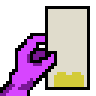
	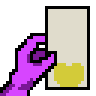
	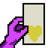
	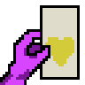
	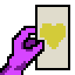
	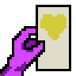
	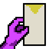
</p>

<p align="center">
	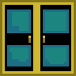
	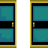
	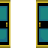
	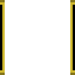
</p>

- Wall painting :

<p align="center">
	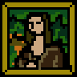
	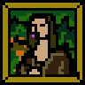
	
	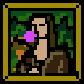
	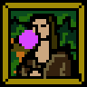
	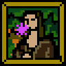
	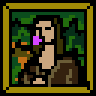
	
</p>

- Hands :

<p align="center">
	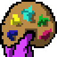
	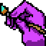
</p>

## Instructions

To create the executable:

```bash
make
```

To run the game:

```bash
./cub3D maps/good/map.cub
```

To clean object files:

```bash
make clean
```

To remove object files and the executable:

```bash
make fclean
```

To recompile the project:

```bash
make re
```

---

## Resources

MiniLibX documentation and tutorial:

* https://harm-smits.github.io/42docs/libs/minilibx

Pixel drawing with MiniLibX:

* https://aurelienbrabant.fr/blog/pixel-drawing-with-the-minilibx

Collision logic:

* https://jonathanwhiting.com/tutorial/collision/
https://zestedesavoir.com/tutoriels/2835/theorie-des-collisions/collisions-en-2d/formes-simples/

MiniLibX color documentation:

* https://harm-smits.github.io/42docs/libs/minilibx/colors.html

Sprite animation reference:

* https://www.youtube.com/watch?v=DFfsYWuupcI

---

## AI Usage

AI was used during the project to:

* help solve GitHub SSH key issues
* explain technical concepts related to raycasting, minimap rendering, collisions, and animations
* improve understanding of implementation techniques
* correct spelling mistakes in the README
* improve the README structure and layout

Thank you.
