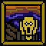
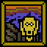
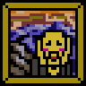
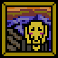
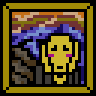
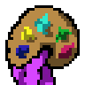
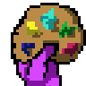
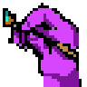
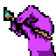

*This project was created as part of the 42 curriculum by [lyaberge] and [mvignes].*

# cub3D

## Description

`cub3D` is a 42 school project, the goal of the project is to create a pseudo-3D game rendering from a 2D map using the **raycasting** technique.
The player can move inside a map, rotate the camera, interact with the environment, and see the world rendered from a first-person perspective.

<p align="center">
	
</p>
---

## Parsing

The parsing part is responsible for reading and validating the `.cub` configuration file.

The file contains several types of information:

### Textures

Each wall direction must have a valid texture path:

* `NO` for the north wall texture
* `SO` for the south wall texture
* `WE` for the west wall texture
* `EA` for the east wall texture

The parser checks that every required texture exists and can be loaded correctly.

### Colors

The floor and ceiling colors are parsed from the file:

* `F` for the floor color
* `C` for the ceiling color

Each color must be written in RGB format:

```txt
F 220,100,0
C 225,30,0
```

The parser checks that the RGB values are valid and between `0` and `255`.

### Map

The map is parsed as a 2D grid.

Accepted characters are:

* `N`, `S`, `E`, `W` for the player's initial position and orientation
* `1` for walls
* `0` for empty floor
* `2` for doors
* `M` for enemies
* spaces for empty areas outside the playable map

The parser checks that:

* the map contains exactly one player
* the map is surrounded by walls or valid empty spaces
* every playable tile is correctly enclosed
* invalid characters are rejected
* the player cannot spawn outside the valid map area

For every playable character except walls, we check the surrounding tiles.
If a playable tile is next to an invalid character, a space, or an empty line in a way that opens the map, the map is considered invalid and an error is returned.

Map example:

```
111111111111111
111111000111111
111110000011111
1111000N0001111
111000000000111
110000000000011
100001111100001
110000111000011
111000010000111
111100000001111
111110000011111
111111000111111
111111111111111
```

---

## Minimap

We developed a minimap to visualize the map in 2D while playing.

The minimap displays:

* walls
* floor tiles
* the player position
* the player direction
* doors
* enemies

The full minimap is displayed when the window is large enough.
If the map is too large for the screen, or if the player wants a smaller display, the tiny minimap is used instead.

Minimap Preview:

<p align="center">
	
	
	
</p>

---

## Tiny Minimap

The tiny minimap is a smaller minimap centered around the player.

It is used when:

* the map is too large to be fully displayed
* the window is too small
* the player presses the `M` key to switch minimap mode

The idea is that the player always stays visually centered in the tiny minimap, while the surrounding map moves around them.

Only a limited number of tiles around the player are displayed.
This number is defined by the `CASE_FROM_PLAYER` value.

The conversion from map coordinates to screen pixels is done with logic similar to:

```c
pixel_x = player_center_x + (map_x - player.pos_x) * SIZE_SQUARE;
pixel_y = player_center_y + (map_y - player.pos_y) * SIZE_SQUARE;
```

This keeps the player centered while moving the map around them smoothly.

Preview:
<p align="center">
	
	
	
</p>

---

## Player Movement

The player can move using the keyboard:

* `W`         -> to move forward
* `S`         -> to move backward
* `A`         -> to move left
* `D`         -> to move right
* left arrow  -> to rotate left
* right arrow -> to rotate right
* `M`         -> to switch minimap mode
* `ESC`       -> to quit the game
* `E`         -> to open the doors
* `P`         -> to activate the wall animation

The player has a position:

```c
pos_x
pos_y
```

And a direction vector:

```c
dir_x
dir_y
```

To move forward, the direction vector is added to the player position.
To move backward, it is subtracted from the player position.
To move left or right, a perpendicular direction vector is used.

Using `double` values for the player position allows smoother movement than moving tile by tile.

---

## Camera Rotation

The camera direction depends on the player's starting orientation in the map:

* `N` for north
* `S` for south
* `E` for east
* `W` for west

At the beginning of the game, the player receives an initial angle depending on this orientation.

When the player presses the left or right arrow, the angle is updated and the direction vector is recalculated with:

```c
dir_x = cos(angle);
dir_y = sin(angle);
```

The camera plane is also updated:

```c
plane_x = -dir_y * 0.66;
plane_y = dir_x * 0.66;
```

The direction vector represents where the player is looking, while the camera plane is used for the raycasting field of view.

---

## Collisions

We added a collision system to prevent the player from walking through walls.

Before updating the player position, the program first calculates the next position the player wants to reach.

The player is not treated as a single point.
Instead, the player is represented as a small square with a safety border around its center position.

This means that, for each movement, we calculate the future borders of the player square:

* the left side of the player
* the right side of the player
* the top side of the player
* the bottom side of the player

```c
player_left = next_pos_x - BORDER_PLAYER;
player_right = next_pos_x + BORDER_PLAYER;
player_top = next_pos_y - BORDER_PLAYER;
player_bottom = next_pos_y + BORDER_PLAYER;
```

Then, these borders are converted into map coordinates to know which map tiles the player square would touch.

```c
map_case_left = (int)player_left;
map_case_right = (int)player_right;
map_case_top = (int)player_top;
map_case_bottom = (int)player_bottom;
```

After that, the collision system checks the map tiles around the future player square.

It checks if one of the sides of the player square would enter a wall tile:

* top-left corner
* top-right corner
* bottom-left corner
* bottom-right corner

If one of these positions corresponds to a wall character, meaning a `1` in the map, the movement is refused.

```c
if (map[map_case_top][map_case_left] == '1'
    || map[map_case_top][map_case_right] == '1'
    || map[map_case_bottom][map_case_left] == '1'
    || map[map_case_bottom][map_case_right] == '1')
{
    return (ERROR);
}
```

This way, the collision is not only checked with the center of the player, but with the full square around the player.

It makes the movement more realistic and prevents the player from:

* walking through walls
* getting too close to a wall
* crossing a wall corner
* entering invalid map areas

The movement is only applied if none of the future player square borders collide with a wall tile.

---

## Raycasting

### Qu'es ce que le raycasting ? A ne pas confondre avec le raytracing.
* Le raycasting simule une vue 3D à partir d'une map 2D. Le principe : pour chaque colonne de pixels de l'écran, on lance un rayon depuis la position du joueur. Quand ce rayon touche un mur, on calcule la hauteur que doit avoir ce mur à l'écran (les murs proches sont grands, les murs lointains sont petits), et on affiche la colonne correspondante de la texture.
* Alors que le raytracing est une méthode de calcul qui lancer des rayons, qui représente le comportement de la lumière lorsqu'elle interagit avec un objet.

### La boucle principal (raycasting.c)

```
fraction = (PI / 3) / screen_width   ← angle entre chaque rayon (FOV 60° divisé en width colonnes)
start_x  = player.angle - PI/6       ← angle du rayon le plus à gauche
```

Pour chaque colonne `i` (de 0 à `game->width - 1`) :
- On appelle `draw_line(game, start_x + i * fraction, i)`
- L'angle du rayon courant = `start_x + i * fraction`
- La colonne du milieu a l'angle exactement égal à `player.angle` (droit devant)

```
Écran de 1200 colonnes :
col 0		col 600		col 1199
  |			|				|
angle		angle			angle
plane-30°	plane			plane+30°
```

Le FOV (champ de vision) est de **60°** (PI/3).

### Initialisation du rayon (init_dda dans draw_line)

Pour chaque rayon d'angle `θ` :

```c
ray->cos_p = cos(θ)					// composante X de la direction du rayon
ray->sin_p = sin(θ)					// composante Y de la direction du rayon
ray->map_x = (int)player.pos_x		// case de la map où est le joueur (X)
ray->map_y = (int)player.pos_y		// case de la map où est le joueur (Y)
```

#### Le DDA (Digital Differential Analyzer) avance dans la map case par case.
Il a besoin de savoir : "si je regarde dans cette direction, quelle distance le rayon doit parcourir pour passer d'une ligne verticale à la suivante ?" et pareil pour les lignes horizontales.

```c
delta_dist_x = |1 / cos_p|			// ← distance pour traverser une case en X
delta_dist_y = |1 / sin_p|			// ← distance pour traverser une case en Y
```

**Pourquoi 1/cos_p ?**  
Le rayon avance d'un pas de 1 en X. En se déplaçant de 1 en X, il parcourt une distance totale de `1/cos_p` (par Pythagore, si cos est la composante X, il faut diviser 1 par cos pour avoir la distance réelle le long du rayon).

### Sens et distances initiales

On détermine le sens du rayon (Est/Ouest et Nord/Sud) et la distance jusqu'à
la première intersection de grille.

```c
if (cos_p < 0) {
	step_x = -1											// rayon va à l'Ouest
	side_dist_x = (pos_x - map_x) * delta_dist_x		// distance jusqu'au bord gauche de la case
} else {
	step_x = +1											// rayon va à l'Est
	side_dist_x = (map_x + 1 - pos_x) * delta_dist_x	// distance jusqu'au bord droit
}
```

Idem pour Y (sin_p < 0 → Nord, sin_p > 0 → Sud)


### Boucle DDA

On avance rayon par rayon jusqu'à toucher un mur ou une porte fermé ('1' ou '2' dans la grille).

À chaque itération, on choisit d'avancer en X ou en Y selon quelle intersection
arrive en premier :

```c
while (pas touché de mur) {
	if (side_dist_x < side_dist_y) {
		side_dist_x += delta_dist_x		// on avance d'une case en X
		map_x += step_x
		wall_touch = 0					// on a traversé une ligne verticale
	} else {
		side_dist_y += delta_dist_y		// on avance d'une case en Y
		map_y += step_y
		wall_touch = 1					// on a traversé une ligne horizontale
	}
	if (grid[map_y][map_x] == '1' || grid[map_y][map_x] == '2')
		touch = true
}
```
#### exemple

```
		 Y=3
		  |
Y=2  +----+----+----+
	 |	|	| M  |	M = mur
Y=1  +----+----+----+
	 |	| J  |	|	J = joueur
Y=0  +----+----+----+
	 X=0  X=1  X=2  X=3

Rayon du joueur vers le NE (cos>0, sin<0) :
Étape 1 : side_dist_x < side_dist_y → avance en X → map_x=2
Étape 2 : side_dist_y < side_dist_x → avance en Y → map_y=2
Étape 3 : side_dist_x < side_dist_y → avance en X → map_x=3 → MUUR !
```

À la fin, map_x et map_y pointent sur la case du mur touché, et
wall_touch vaut 0 (mur vertical / face E ou O) ou 1 (mur horizontal / face N ou S).


### Correction du fisheye

Sans correction, les murs sur les côtés de l'écran paraissent plus proches qu'ils ne le sont (effet "oeil de poisson", c'est murs arrondi). On multiplie par cos(angle_diff) pour corriger :

```c
angle_correctif = angle_rayon - player.plane	// écart angulaire par rapport au centre
dist_perp *= cos(angle_correctif)
```

### Select direction du mur

On selectionne le wall_touch (0 ou 1) en la vraie face touchée (1, 2, 3, ou 4) :

```c
if (ray->wall_touch == 0)
{										// rayon a traversé une ligne verticale
	if (step_x > 0)
		ray->wall_touch = 3 (IS_EAST)		// rayon allait Est → face Ouest du mur
	else
		ray->wall_touch = 4 (IS_WEAST)		// rayon allait Ouest → face Est du mur
}
else
{										// rayon a traversé une ligne horizontale
	if (step_y > 0)
		ray->wall_touch = 1 (IS_SOUTH)		// rayon allait Sud → face Nord du mur
	else
		ray->wall_touch = 2 (IS_NORTH)		// rayon allait Nord → face Sud du mur
}
```

### Dessiné le mur

Plus le mur est loin, plus il est petit à l'écran :

```c
line_height	= screen_height / dist_perp						// hauteur en pixels du mur
start_y		= (screen_height / 2) - (line_height / 2)		// pixel du haut du mur
end			= (screen_height / 2) + (line_height / 2)		// pixel du bas du mur
```

Et il faut recalculé la disctense du mur, la distance brute
de la vraie position Y (ou X) d'impact :

```c
// Pour un mur Est/Ouest (face verticale) :
dist_brute = (map_x - pos_x + (1 - step_x) / 2.0) / cos_p
wall_x = pos_y + dist_brute * sin_p							// coordonnée Y de l'impact

// Pour un mur Nord/Sud (face horizontale) :
dist_brute = (map_y - pos_y + (1 - step_y) / 2.0) / sin_p
wall_x = pos_x + dist_brute * cos_p							// coordonnée X de l'impact
```

### Dessin pixel par pixel

Pour chaque pixel y de la colonne i :

```c
// Plafond
if (y < start_y)
	put_pixel(game, i, y, couleur_plafond)

// Mur
else if (y >= start_y && y <= end) {
	pos_tex_y = (int)pos_tex & (tex_height - 1)
	pos_tex += step
	couleur = get_pixel_from_texture(tex, pos_tex_x, pos_tex_y)
	put_pixel(game, i, y, couleur)
}

// Sol
else
	put_pixel(game, i, y, couleur_sol)
```

---

## Game Loop

The game loop is handled with:

```c
mlx_loop_hook(...)
```

This allows the display to be updated continuously.

At each frame, the program:

1. checks which keys are currently pressed
2. updates the player position if movement is possible
3. updates the camera angle if needed
4. clears the previous image
5. redraws the scene
6. redraws the minimap or tiny minimap
7. displays the new image in the window

This allows smooth movement while a key is being held down.

---

## Animations

## Animations

All animations were created using pixel art.
Each sprite was drawn by hand with **Piskel**, then exported as several separate frames.

The animation system works frame by frame.
Each animated element stores:

* the current frame index
* the total number of frames
* a frame delay
* a loop counter

At each game loop iteration, the animation counter is increased.
When the counter reaches the defined frame delay, the current frame changes to the next one.

Each frame is then drawn on screen according to the current `frame_id`.
The game loop continuously updates the animation, so the sprite appears animated while the game is running.

This system is used to animate pixel sprites inside the game, such as enemies, doors opening or decorative elements.

## Pixel Art:

- Open door animation:

<p align="center">
	
	
	
	
	
	
	
</p>

- Wall painting :

<p align="center">
	
	
	
	
	
	
	
	
</p>

<p align="center">
	
	
	
	
	
	
	
	
</p>

- Hands:

<p align="center">
	
	
	
	
	
	
	
	
</p>

## Instructions

To create the executable:

```bash
make
```

To run the game:

```bash
./cub3D maps/good/map.cub
```

To clean object files:

```bash
make clean
```

To remove object files and the executable:

```bash
make fclean
```

To recompile the project:

```bash
make re
```

---

## Resources

MiniLibX documentation and tutorial:

* https://harm-smits.github.io/42docs/libs/minilibx

Pixel drawing with MiniLibX:

* https://aurelienbrabant.fr/blog/pixel-drawing-with-the-minilibx

Collision logic:

* https://jonathanwhiting.com/tutorial/collision/
https://zestedesavoir.com/tutoriels/2835/theorie-des-collisions/collisions-en-2d/formes-simples/

MiniLibX color documentation:

* https://harm-smits.github.io/42docs/libs/minilibx/colors.html

Sprite animation reference:

* https://www.youtube.com/watch?v=DFfsYWuupcI

Mouse Mouvement:

* https://discourse.libsdl.org/t/first-person-camera-mouse-movement-sdl2-opengl/23936
* https://www.youtube.com/watch?v=LA__RqBExiU

---

## AI Usage

AI was used during the project to:

* help solve GitHub SSH key issues
* explain technical concepts related to raycasting, minimap rendering, collisions, and animations
* improve understanding of implementation techniques
* correct spelling mistakes in the README
* improve the README structure and layout

Thank you.
